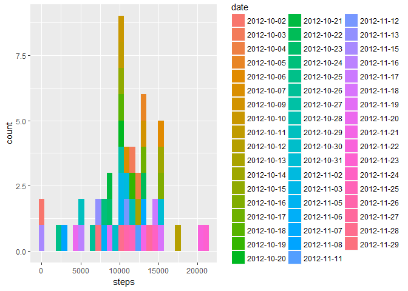
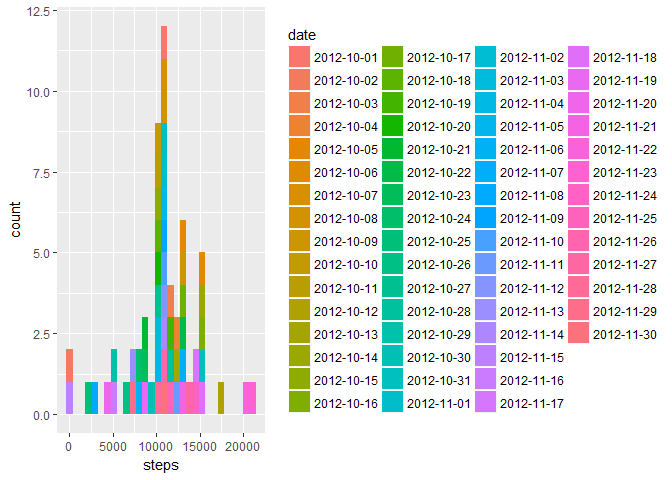
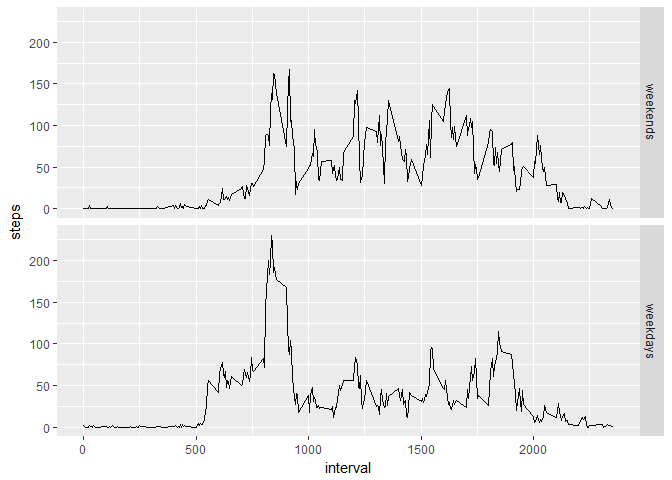

# Reproducible Research: Peer Assessment 1


```r
## Loading and preprocessing the data
library(dplyr)
```

```
## 
## Attaching package: 'dplyr'
```

```
## The following objects are masked from 'package:stats':
## 
##     filter, lag
```

```
## The following objects are masked from 'package:base':
## 
##     intersect, setdiff, setequal, union
```

```r
library(ggplot2)
library(lubridate)
```

```
## 
## Attaching package: 'lubridate'
```

```
## The following object is masked from 'package:base':
## 
##     date
```

```r
library(zoo)
```

```
## Warning: package 'zoo' was built under R version 3.3.3
```

```
## 
## Attaching package: 'zoo'
```

```
## The following objects are masked from 'package:base':
## 
##     as.Date, as.Date.numeric
```

```r
unzip("activity.zip")
data<-tbl_df(read.csv("activity.csv"))


## What is mean total number of steps taken per day?

#Make a histogram of the total number of steps taken each day
datanaremove<-na.omit(data)
datanaremoveday<-summarise(group_by(datanaremove,date),sum(steps))
names(datanaremoveday)<-c("date","steps")
qplot(steps,data=datanaremoveday,fill=date)
```

```
## `stat_bin()` using `bins = 30`. Pick better value with `binwidth`.
```

<!-- -->

```r
#Calculate and report the **mean** and **median** total number of steps taken per day
mean(datanaremoveday$steps)
```

```
## [1] 10766.19
```

```r
median(datanaremoveday$steps)
```

```
## [1] 10765
```

```r
## What is the average daily activity pattern?

#Make a time series plot (i.e. `type = "l"`) of the 5-minute interval (x-axis) and the average number of steps taken, averaged across all days (y-axis)
datanaremoveinterval<-summarise(group_by(datanaremove,interval),mean(steps))
names(datanaremoveinterval)<-c("interval","steps")
qplot(interval,steps,data=datanaremoveinterval,geom = "line")
```

<!-- -->

```r
# Which 5-minute interval, on average across all the days in the dataset, contains the maximum number of steps?
datanaremoveinterval[which.max(datanaremoveinterval$steps),1]
```

```
## # A tibble: 1 × 1
##   interval
##      <int>
## 1      835
```

```r
## Imputing missing values

# Calculate and report the total number of missing values in the dataset (i.e. the total number of rows with `NA`s)
sum(is.na(data$steps))
```

```
## [1] 2304
```

```r
#Devise a strategy for filling in all of the missing values in the dataset. The strategy does not need to be sophisticated. For example, you could use the mean/median for that day, or the mean for that 5-minute interval, etc.
#Create a new dataset that is equal to the original dataset but with the missing data filled in by the mean value of the non missing data for its interval.
data$steps<-na.aggregate(data$steps,data$interval)

#Make a histogram of the total number of steps taken each day after imputing the NAs.
dataday<-summarise(group_by(data,date),sum(steps))
names(dataday)<-c("date","steps")
qplot(steps,data=dataday,fill=date)
```

```
## `stat_bin()` using `bins = 30`. Pick better value with `binwidth`.
```

<!-- -->

```r
#Calculate and report the **mean** and **median** total number of steps taken per day after imputing the NAs.
mean(dataday$steps)
```

```
## [1] 10766.19
```

```r
median(dataday$steps)
```

```
## [1] 10766.19
```

```r
## Are there differences in activity patterns between weekdays and weekends?
#Create a new factor variable in the dataset with two levels -- "weekday" and "weekend" indicating whether a given date is a weekday or weekend day.
data$date<-as.character(data$date)
data$date<-ymd(data$date)
data<-mutate(data,weekday=ifelse(weekdays(data$date)=="Sunday"|weekdays(data$date)=="Saturday",0,1))
# Make a panel plot containing a time series plot (i.e. `type = "l"`) of the 5-minute interval (x-axis) and the average number of steps taken, averaged across all weekday days or weekend days (y-axis).
datainterval<-summarise(group_by(data,interval,weekday),mean(steps))
names(datainterval)<-c("interval","weekday","steps")
datainterval$weekday<-as.factor(datainterval$weekday)
levels(datainterval$weekday) <- c("weekends", "weekdays")
ggplot(data = datainterval,aes(interval,steps))+geom_line()+facet_grid(weekday~.)
```

<!-- -->
