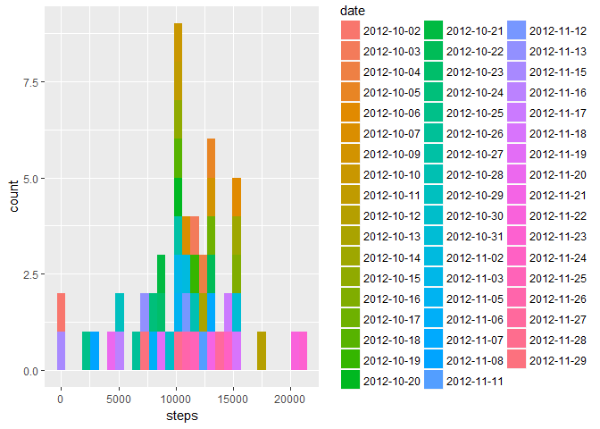
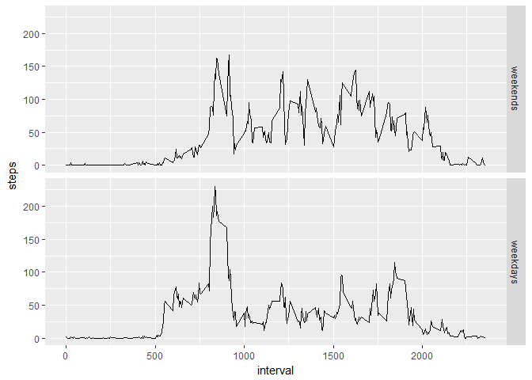

# Reproducible Research: Peer Assessment 1
## Loading and preprocessing the data

```r
suppressMessages(library(dplyr))
suppressMessages(library(ggplot2))
suppressMessages(library(lubridate))
suppressWarnings(library(zoo))
```

```
## 
## Attaching package: 'zoo'
```

```
## The following objects are masked from 'package:base':
## 
##     as.Date, as.Date.numeric
```

```r
unzip("activity.zip")
data<-tbl_df(read.csv("activity.csv"))
```

##Make a histogram of the total number of steps taken each day

```r
datanaremove<-na.omit(data)
datanaremoveday<-summarise(group_by(datanaremove,date),sum(steps))
names(datanaremoveday)<-c("date","steps")
qplot(steps,data=datanaremoveday,fill=date)
```

```
## `stat_bin()` using `bins = 30`. Pick better value with `binwidth`.
```

<!-- -->

##Calculate and report the **mean** and **median** total number of steps taken per day

```r
mean1<-mean(datanaremoveday$steps)
median1<-median(datanaremoveday$steps)
```
The mean and median of the total number of steps taken per day are 1.0766189\times 10^{4} and 10765 respectively.

##Make a time series plot (i.e. `type = "l"`) of the 5-minute interval (x-axis) and the average number of steps taken, averaged across all days (y-axis)

```r
datanaremoveinterval<-summarise(group_by(datanaremove,interval),mean(steps))
names(datanaremoveinterval)<-c("interval","steps")
qplot(interval,steps,data=datanaremoveinterval,geom = "line")
```

<!-- -->

## Which 5-minute interval, on average across all the days in the dataset, contains the maximum number of steps?

```r
maxinterval<-datanaremoveinterval[which.max(datanaremoveinterval$steps),1]
```
The 835 5-minute interval contains the maximum number of steps.

## Calculate and report the total number of missing values in the dataset (i.e. the total number of rows with `NA`s)

```r
sumna<-sum(is.na(data$steps))
```
The total number of missing values in the dataset is 2304.

##filling the misssing values and creating a new data frame.

```r
data$steps<-na.aggregate(data$steps,data$interval)
```

##make a histogram of the total number of steps taken each day after imputing the NAs.

```r
dataday<-summarise(group_by(data,date),sum(steps))
names(dataday)<-c("date","steps")
qplot(steps,data=dataday,fill=date)
```

```
## `stat_bin()` using `bins = 30`. Pick better value with `binwidth`.
```

<!-- -->

##Calculate and report the **mean** and **median** total number of steps taken per day after imputing the NAs.

```r
mean2<-mean(dataday$steps)
median2<-median(dataday$steps)
```
The new mean and median of the total number of steps taken per day are 1.0766189\times 10^{4} and 1.0766189\times 10^{4} respectively. The new mean and median is slightly higher than the mean and median computed earlier (1.0766189\times 10^{4} and 10765 respectively). Hence, the estimates might be higher using the new dataset.

##Create a new factor variable in the dataset with two levels -- "weekday" and "weekend" indicating whether a given date is a weekday or weekend day.

```r
data$date<-as.character(data$date)
data$date<-ymd(data$date)
data<-mutate(data,weekday=ifelse(weekdays(data$date)=="Sunday"|weekdays(data$date)=="Saturday",0,1))
```

## Make a panel plot containing a time series plot (i.e. `type = "l"`) of the 5-minute interval (x-axis) and the average number of steps taken, averaged across all weekday days or weekend days (y-axis).

```r
datainterval<-summarise(group_by(data,interval,weekday),mean(steps))
names(datainterval)<-c("interval","weekday","steps")
datainterval$weekday<-as.factor(datainterval$weekday)
levels(datainterval$weekday) <- c("weekends", "weekdays")
ggplot(data = datainterval,aes(interval,steps))+geom_line()+facet_grid(weekday~.)
```

<!-- -->
